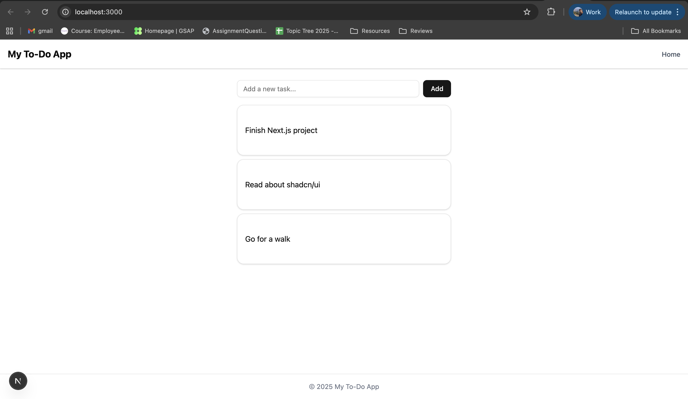
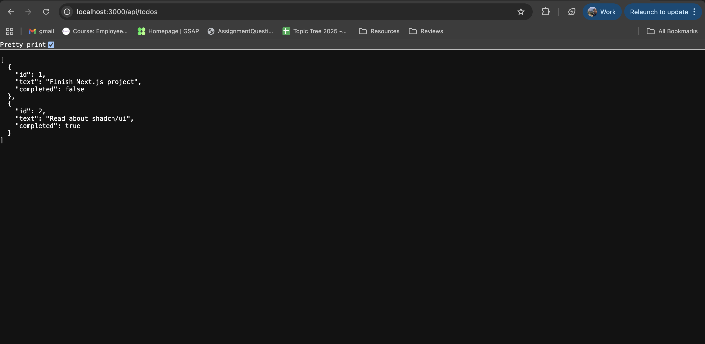

## 🚀 Step 1: Install shadcn/ui
First, initialize shadcn/ui in your Next.js project. This command will guide you through the initial setup.
```
npx shadcn-ui@latest init
```
Next, install the specific components you'll need for the UI. We'll start with a button, an input field, and a card for layout.

```
npx shadcn-ui@latest add button input card
```

## 📂 Step 2: Create a Basic Layout
Create a reusable layout component to provide a consistent structure (Header, Main Content, Footer) across your application.

Create the file src/components/layout.tsx:

```TypeScript

import { ReactNode } from "react"

export default function Layout({ children }: { children: ReactNode }) {
  return (
    <div className="flex min-h-screen flex-col">
      <header className="border-b bg-white p-4 shadow-sm">
        <h1 className="text-xl font-bold">My To-Do App</h1>
      </header>

      <main className="container mx-auto flex-1 p-6">{children}</main>

      <footer className="border-t bg-white p-4 text-center text-sm text-gray-500">
        © 2025 My To-Do App
      </footer>
    </div>
  )
}
```

## 📂 Step 3: Build a Standalone Header Component
If you prefer a more modular approach, you can create a separate Header component instead of defining it directly inside the Layout component.

Create the file src/components/header.tsx:

```TypeScript

import Link from "next/link"

export default function Header() {
  return (
    <header className="flex items-center justify-between border-b bg-white p-4 shadow-sm">
      <h1 className="text-xl font-bold">My To-Do App</h1>
      <nav>
        <Link href="/" className="text-sm font-medium text-gray-600 hover:text-black">
          Home
        </Link>
      </nav>
    </header>
  )
}
```

You can then import and use this Header component in your pages, for example, in src/app/page.tsx:

```TypeScript

import Header from "@/components/header";

export default function Home() {
  return (
    <div>
      <Header />
      {/* The rest of your page content goes here */}
    </div>
  );
}
```

After we create these components, we have to look at our app directory. We can see that there are two type script files, one of them is layout.TSX, and another one is page.TSX. The layout.TSX will have the HTML tag and the body tag and will have a child inside it. 
The child is going to be whatever you write inside your page.SX that is right next to it in the app directory. 

What we will do is, we are going to import our layout.TSX in the components directory into the page.TSX in the app directory.

Inside the layout or TSX that comes from our components directory, we will have our basic layout of the page, which includes components like header, footer, to do list and to do input.




# Backend

## 🛠 Step 1: Create the API Directory

Inside your project, make a folder:

src/app/api/todos/

## 🛠 Step 2: Create the To-Do API File

Inside that folder, create:

src/app/api/todos/route.ts

## 🛠 Step 3: Define Basic Endpoint Logic

We’ll use an in-memory array (data resets when server restarts).

src/app/api/todos/route.ts:

```ts
import { NextResponse } from "next/server"

// In-memory todo list
let todos = [
  { id: 1, text: "Finish Next.js project", completed: false },
  { id: 2, text: "Read about shadcn/ui", completed: true },
]

// GET /api/todos → fetch all todos
export async function GET() {
  return NextResponse.json(todos)
}

// POST /api/todos → add a new todo
export async function POST(request: Request) {
  const body = await request.json()
  const newTodo = {
    id: Date.now(),
    text: body.text,
    completed: false,
  }
  todos.push(newTodo)
  return NextResponse.json(newTodo, { status: 201 })
}

// PUT /api/todos → update an existing todo
export async function PUT(request: Request) {
  const body = await request.json()
  const { id, text, completed } = body

  todos = todos.map((todo) =>
    todo.id === id ? { ...todo, text, completed } : todo
  )

  return NextResponse.json({ success: true })
}

// DELETE /api/todos → delete a todo
export async function DELETE(request: Request) {
  const body = await request.json()
  const { id } = body

  todos = todos.filter((todo) => todo.id !== id)

  return NextResponse.json({ success: true })
}
```

## 🛠 Step 4: Test Your API

Run your dev server:

```
npm run dev
```

Now test these endpoints:
```
GET → http://localhost:3000/api/todos
```



```
POST → POST /api/todos with JSON body:

{ "text": "New Task" }
```

```
PUT → PUT /api/todos with JSON body:

{ "id": 1, "text": "Updated Task", "completed": true }
```

```
DELETE → DELETE /api/todos with JSON body:

{ "id": 1 }
```
<br/><br/>

# Deploying

You can test using Postman, Thunder Client (VSCode extension), or cURL.

🔹 1. Vercel (Best + Easiest)

✅ Official hosting platform for Next.js (built by the same company).

✅ Automatic serverless API routes (your /api/todos will work out of the box).

✅ Free tier available.

✅ One-click GitHub/GitLab/Bitbucket integration.

How to deploy:

* Push your project to GitHub (or GitLab/Bitbucket).

* Go to vercel.com and create an account.

* Click New Project → Import your repo.

* Vercel auto-detects Next.js → just click Deploy.

* You’ll get a live URL like https://my-next-app.vercel.app.


